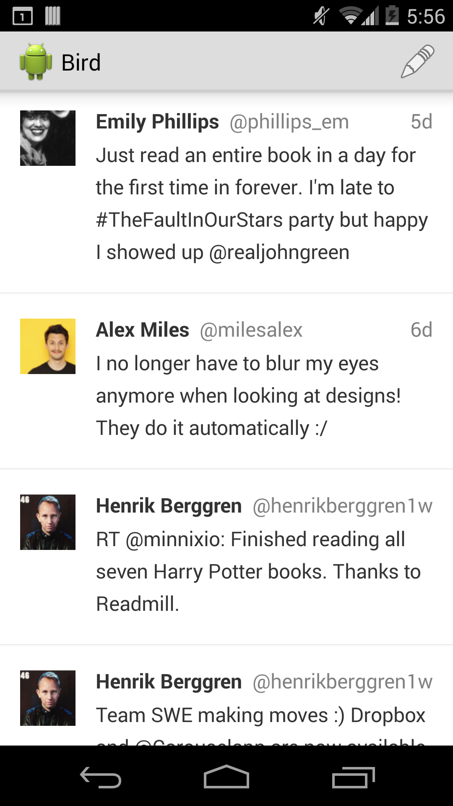
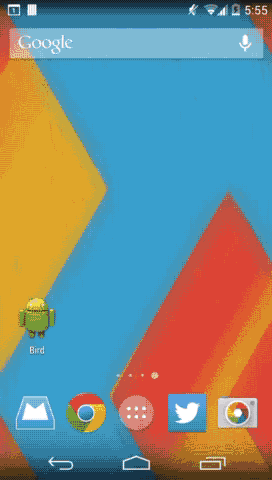

Bird
====

Bird is an Android Twitter client in development and was started as an assignment for CodePath bootcamp.

&nbsp;

Features
--------

Bird currently provides the following functionality:
* List most recent tweets in your timeline
* Persist fetched tweets for viewing them offline
* Compose a new tweet in a dialog

Building
--------

You can build the app using Android Studio by following next steps:
* `git clone git@github.com:tomazsh/bird-android-app.git`
* Open Android Studio and click “Import project”
* Select and open the `bird-android-app` you’ve cloned from Github
* Build and run

Contributing
------------

All of your contributions are greatly appreciated. Feel free to open a pull request.

License
-------

All code is distributed under MIT license. See LICENSE file for more information.
